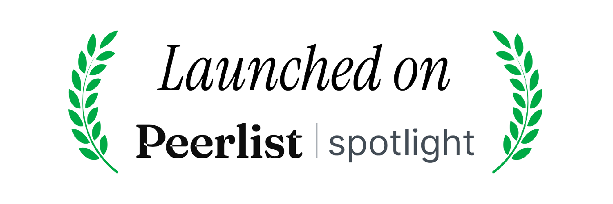

# Cohesion Game

Connections like game where you can create custom games and play with your friends.

<section class="flex-container">

 </section>

## How to play

https://github.com/user-attachments/assets/dfffcb2a-74df-448d-8d5f-e5a6c409a6c9

<!--  -->

Select words with something in common and click submit. You win if you correctly guess the commonality between all the words.

> We Also have a Reddit Application you can add to your subreddit!
> [Cohesion Reddit App](https://github.com/TejasBhovad/cohesion)

## Tech Stack

- Sveltekit
- TailwindCSS
- Redis(Upstash)
- Supabase
- AuthJS
